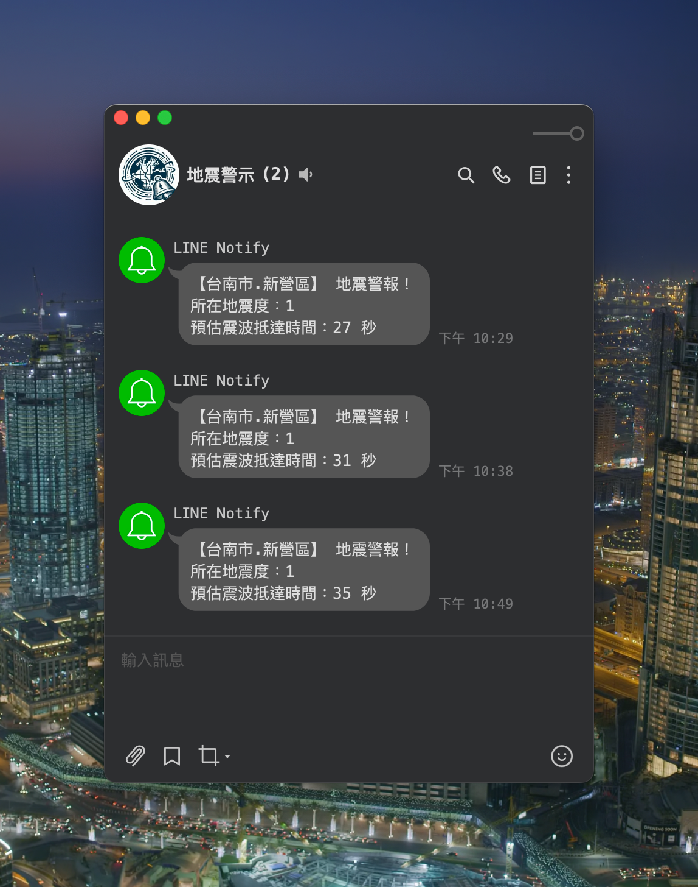

# earthquake-alert

使用 Typescript 撰寫，並使用 bun 打包成執行檔。  
配合 地牛 Wake Up! 的連動功能，當地震發生時，會自動發送通知到 LINE。

## 安裝 地牛 Wake Up

URL: [https://eew.earthquake.tw/](https://eew.earthquake.tw/)


## 申請 LINE Notify

URL: [https://notify-bot.line.me/my/](https://notify-bot.line.me/my/)


## 使用說明

### 1. 下載專案

```bash
git clone https://github.com/fish-can/earthquake-alert.git
```

### 2. 安裝相依套件

```bash
bun install
```

> 若沒有安裝 bun，請先安裝 bun  
> URL: [https://bun.sh/](https://bun.sh/)

### 3. 輸入 LINE Notify 的 Access-Token


### 4. 建置專案

```bash
bun run build
```

### 5. 連結 Wake Up!

設定頁面 / 其他 / 連動設定


選取建置好的執行檔


### 6. 完成



## 注意事項

- 請確保 Wake Up! 的連動設定是正確的
- 請確保 LINE Notify 的 Access-Token 是正確的

## 特別感謝

- 地牛 Wake Up!
- LINE Notify

## 其他

若有任何問題，歡迎提出 issue。
